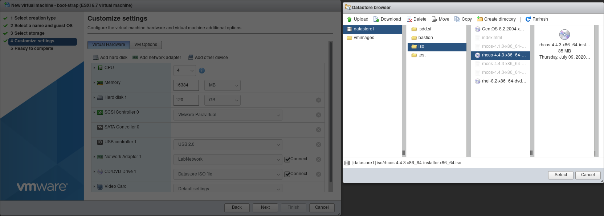

# OCP4 nodes
When using UPI on VMware cluster nodes can be created manually or programmatically.

Openshift nodes can be installed using ISO image, PXE/TFTP or imported from OVA image.

## Create a VM from ISO
https://docs.openshift.com/container-platform/4.4/installing/installing_bare_metal/installing-bare-metal.html#installation-initializing-manual_installing-bare-metal[Documentation^]

To create a VM manually using Web UI:

* Configure a new VM in ESXi UI: Virtual machines -> Create/Register VM
  - Type: new VM
  - Name: name of the VM in the list
  - Guest OS Family: Linux
  - Guest OS version: CoreOS Linux
  - datastore: datastore1
  - CPU, memory, disk: see the https://docs.openshift.com/container-platform/4.4/installing/installing_bare_metal/installing-bare-metal.html#minimum-resource-requirements_installing-bare-metal[spec^]
  - Network: LabNetwork (internal network)
  - CD drive: datastore1/iso/rhcos-4.4.3-x86_64-installer.x86_64.iso uploaded to ESXi datastore
* There is no DHCP service running. Static IP settings are configured at the boot loader. Boot and press TAB or E to interrupt the boot process
* Configure kernel parameters:
```
coreos.inst=yes
coreos.inst.install_dev=sda
coreos.inst.image_url=http://192.168.0.1/rhcos.raw.gz
coreos.inst.ignition_url=http://192.168.0.1/<ignition configuration>.ign
ip=192.168.0.XX::192.168.0.1:255.255.255.0:<node name>.sandbox-ocp4.cmpf.schwarz::none nameserver=192.168.0.1
```

Notes:

* 192.168.0.1 is default router. It must be set even if the routing is not setup. Otherwise the setup will not finish.
* <ignition configuration>.ign files are created during installer configuration phase.
* rhcos.raw.gz points to rhcos-4.4.3-x86_64-metal.x86_64.raw.gz

.Create VM
[.thumb]


.VM name and type
[.thumb]


.datastore
[.thumb]


.VM parameters
[.thumb]


.VM summary
[.thumb]


## Bootstrap
* CPU: 4
* Memory: 16384 MB
* disk: 120 GB
* CD: datastore1/iso/rhcos-4.4.3-x86_64-installer.x86_64.iso
* Network: LabNetwork (internal network)

Boot parameters:
```
coreos.inst=yes
coreos.inst.install_dev=sda
coreos.inst.image_url=http://192.168.0.1/rhcos.raw.gz
coreos.inst.ignition_url=http://192.168.0.1/bootstrap.ign
ip=192.168.0.30::192.168.0.1:255.255.255.0:bootstrap.sandbox-ocp4.cmpf.schwarz::none nameserver=192.168.0.1
```
## Masters
* CPU: 4
* Memory: 16384 MB
* disk: 120 GB
* CD: datastore1/iso/rhcos-4.4.3-x86_64-installer.x86_64.iso
* Network: LabNetwork (internal network)

Boot parameters:
```
coreos.inst=yes
coreos.inst.install_dev=sda
coreos.inst.image_url=http://192.168.0.1/rhcos.raw.gz
coreos.inst.ignition_url=http://192.168.0.1/master.ign
ip=192.168.0.1X::192.168.0.1:255.255.255.0:ocp-master-X.sandbox-ocp4.cmpf.schwarz::none nameserver=192.168.0.1
```

Adjust boot parameters for each master node to use values listed in the table below:

.Masters
[options="header"]
|=======================
|Hostname|IP
|ocp-master-0.sandbox-ocp4.cmpf.schwarz    |192.168.0.10
|ocp-master-1.sandbox-ocp4.cmpf.schwarz    |192.168.0.11
|ocp-master-2.sandbox-ocp4.cmpf.schwarz    |192.168.0.12
|=======================

## Workers
* CPU: 2
* Memory: 8196 MB
* disk: 120 GB
* CD: datastore1/iso/rhcos-4.4.3-x86_64-installer.x86_64.iso
* Network: LabNetwork (internal network)

Boot parameters:
```
coreos.inst=yes
coreos.inst.install_dev=sda
coreos.inst.image_url=http://192.168.0.1/rhcos.raw.gz
coreos.inst.ignition_url=http://192.168.0.1/worker.ign
ip=192.168.0.2X::192.168.0.1:255.255.255.0:ocp-compute-X.sandbox-ocp4.cmpf.schwarz::none nameserver=192.168.0.1
```

Adjust boot parameters for each worker node to use values listed in the table below:

.Workers
[options="header"]
|=======================
|Hostname|IP
|ocp-compute-0.sandbox-ocp4.cmpf.schwarz    |192.168.0.20
|ocp-compute-1.sandbox-ocp4.cmpf.schwarz    |192.168.0.21
|ocp-compute-2.sandbox-ocp4.cmpf.schwarz    |192.168.0.22
|=======================

## Cluster installation
When VMs are started with appropriate boot parameters they go thru the bootstrap process and eventually form the cluster. Watch the installation on the bastion: `./openshift-install --dir=ocp4 wait-for bootstrap-complete --log-level=info`
```
INFO Waiting up to 20m0s for the Kubernetes API at https://api.sandbox-ocp4.cmpf.schwarz:6443...
INFO API v1.17.1+166b070 up
INFO Waiting up to 40m0s for bootstrapping to complete...
INFO It is now safe to remove the bootstrap resources
```

Remove bootstrap from the loadbalancer: remove bootstrap entries in /etc/haproxy/haproxy.cfg. Restart haproxy: `systemctl restart haproxy`

Remove bootstrap VM:
* SSH to bootstrap from bastion: `ssh core@bootstrap`
* shutdown: `sudo poweroff`

Verify the cluster:
```
export KUBECONFIG=/root/ocp4/auth/kubeconfig
oc whoami
oc get nodes
```
