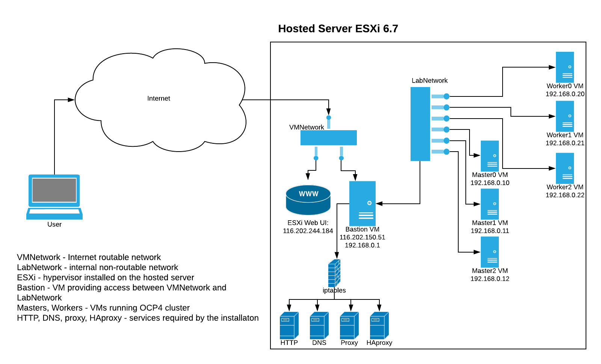

# Openshift 4.x on VMware ESXi

.Hosted server
[.thumb]

This repository contains files and documents describing the installation of Red Hat Openshift 4.x cluster on VMware ESXi 6.7 running on a hosted server.
It follows the https://docs.openshift.com/container-platform/4.4/installing/installing_vsphere/installing-restricted-networks-vsphere.html[official documentation^] describing the installation on VMware vSphere and describes a fairly similar experience.
But due to differences between free ESXi and complete vSphere and because enterprise vSphere deployments might span multiple data centers the installation follows the https://docs.openshift.com/container-platform/4.4/installing/installing_bare_metal/installing-restricted-networks-bare-metal.html[bare-metal installation^] process. All resources are created and configured manually.
OCP version 4.5 supports IPI installations but those are limited to vSphere in one DC. Thus it is incompatible with the ESXi setup.

Many decisions and assumptions taken in this setup were dictated by requirements from one of the projects in which Openshift 4.4 is deployed on VMware vSphere 6.7.

The server running VMware ESXi has an Internet address 116.202.244.184. A Web UI is available at https://116.202.244.184/ui/. See link:01_hosting.adoc[hosting.adoc] for more details.

In addition another IP 116.202.150.51 is assigned to a VM - bastion - running services required for the installation.

Openshift 4 cluster is created on an internal network LabNetwork 192.168.0.0/24. The VM running services has 193.168.0.1 on this network. The network is not routable, the only way to access the Internet is via proxy running on bastion VM.
